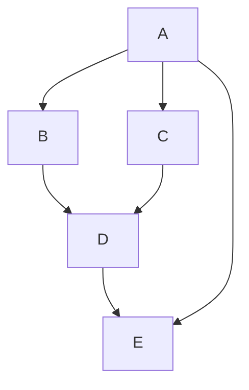
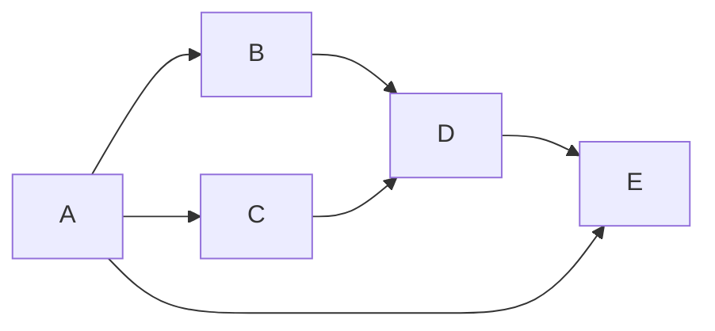
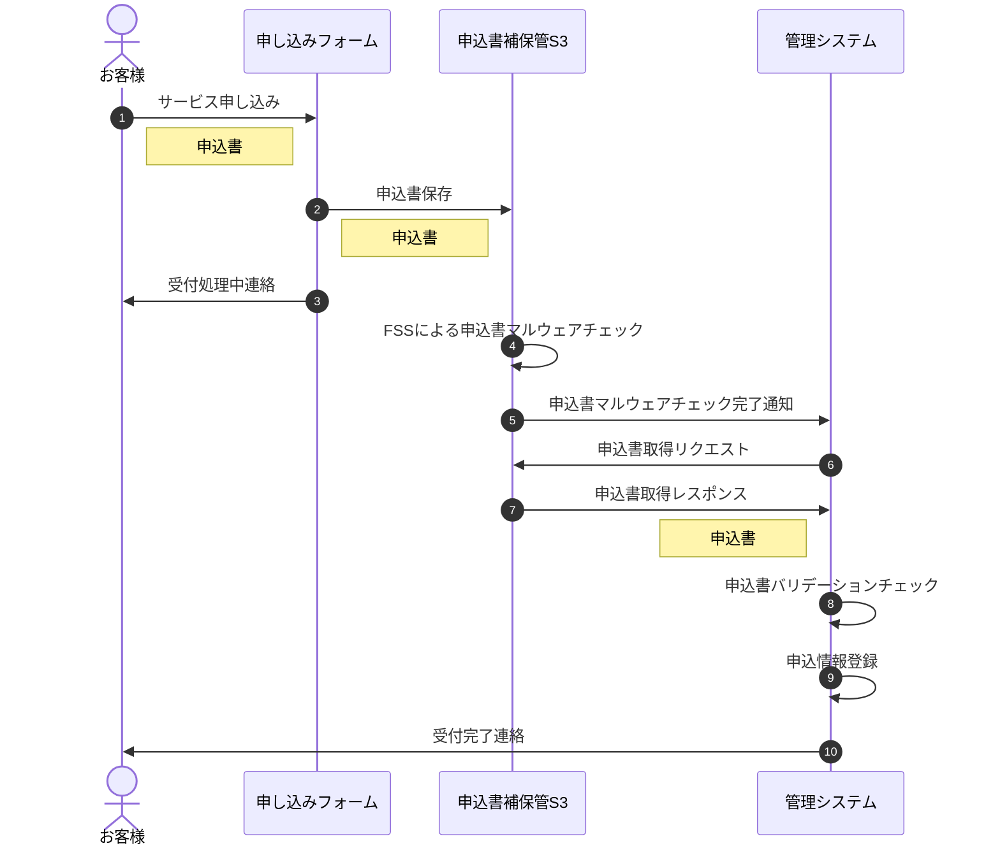

# 今日の天気

## 晴れ

```mermaid
graph TD;
    A-->B
    A-->C
    B-->D
    C-->D
    D-->E
    A-->E

```

```mermaid
graph LR;
    A-->B
    A-->C
    B-->D
    C-->D
    D-->E
    A-->E

```

```mermaid
sequenceDiagram
    autonumber
    actor お客様
    participant form as 申し込みフォーム
    participant s3 as 申込書補保管S3
    participant admin as 管理システム
    お客様->>form: サービス申し込み
    Note left of form: 申込書
    form->>s3: 申込書保存
    Note left of s3: 申込書
    form->>お客様: 受付処理中連絡
    s3->>s3: FSSによる申込書マルウェアチェック
    s3->>admin: 申込書マルウェアチェック完了通知
    admin->>s3: 申込書取得リクエスト
    s3->>admin: 申込書取得レスポンス
    Note left of admin: 申込書;
    admin->>admin: 申込書バリデーションチェック
    admin->>admin: 申込情報登録
    admin->>お客様: 受付完了連絡
```
